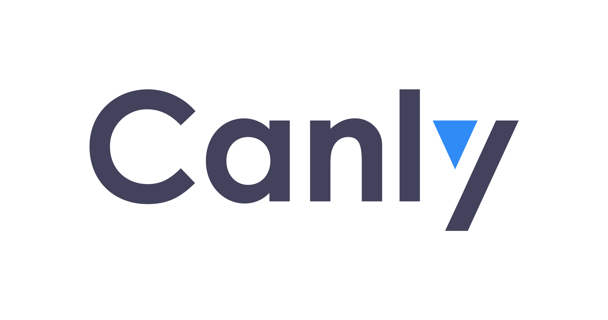
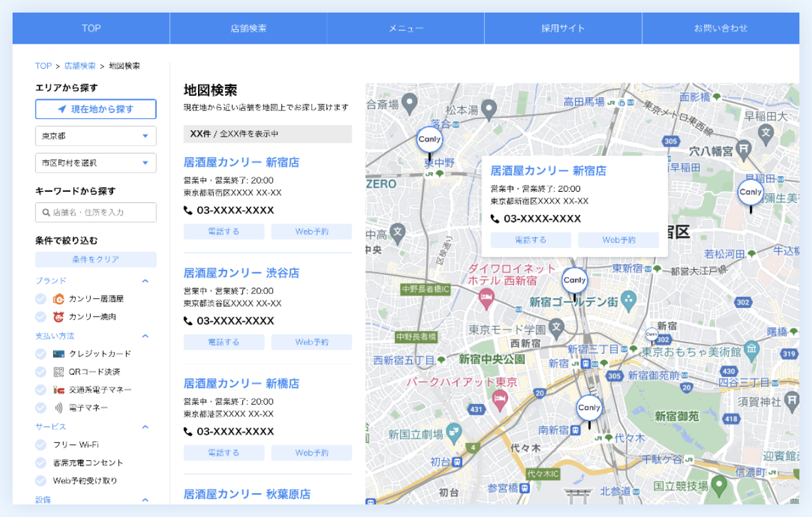
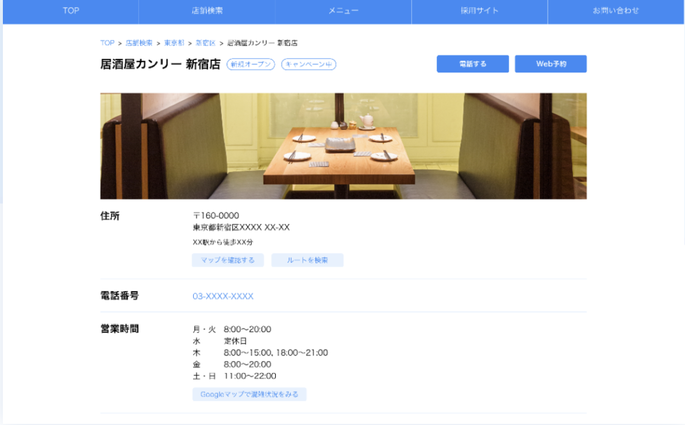
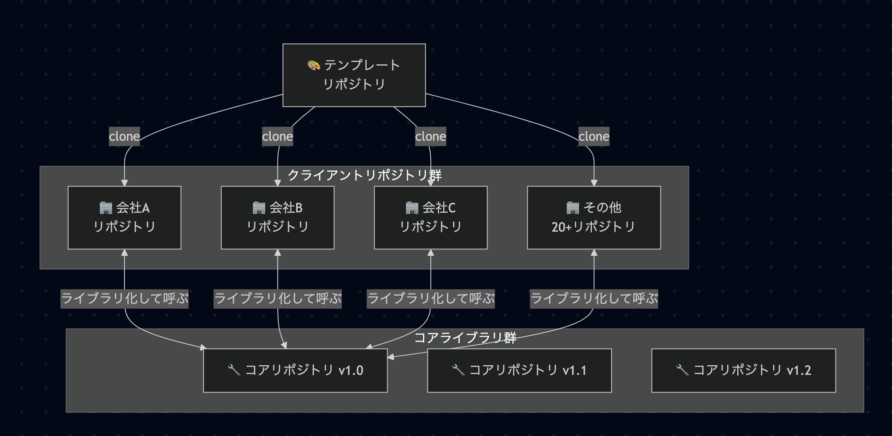
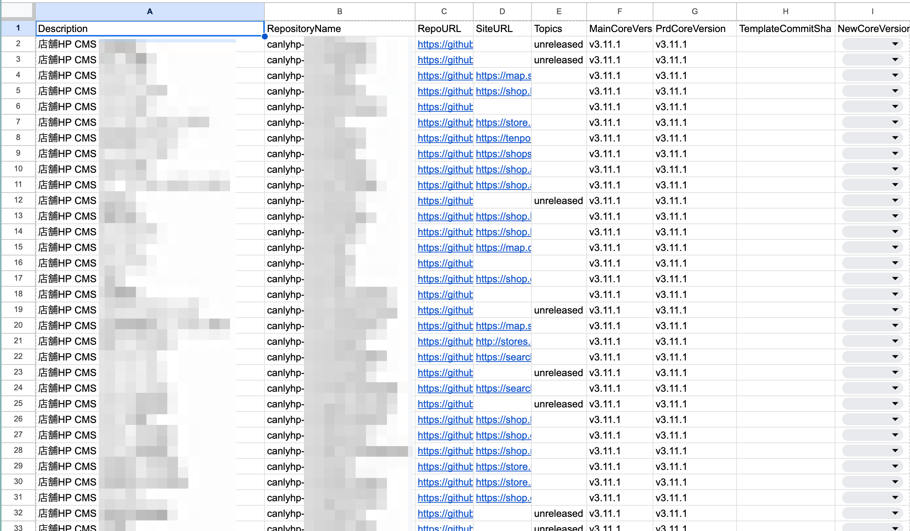
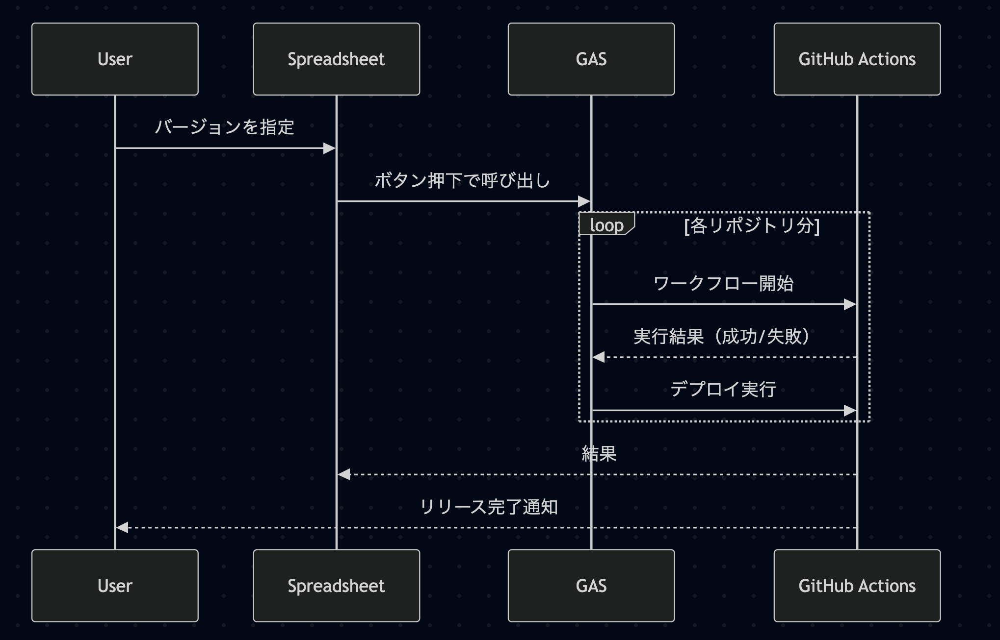

# 複数リポジトリ環境下の バージョン管理システム 構築と運用

## めぐろ LT #28  株式会社カンリー 角谷維

---

<!-- _class: two-column -->

## 自己紹介

### 🙋‍♂️ About Me

- **Name**: 角谷 維(すみや たもつ) / motsuo
- **Company**: 株式会社カンリー
- **Role**: web エンジニア / 一応フロントエンド
- **Hobbies**: 音楽 / ポーカー / 古着屋行く
- **Other**: このスライド marp で書いてみました

###

---

<!-- _class: subsection -->
<!-- paginate: false -->

# 弊社サービスの概要と背景

---

## 所属プロダクトの概要

### 🏠 カンリーホームページとは

- HP 来訪者の実店舗への来訪動線を**最適化するホームページ**
- クライアントは CMS として**ページ**を管理
- クライアントは店舗検索ページを簡単に作成、修正ができる
- header,footer を変更し、**サブドメイン**として運用

---

## 所属プロダクトの概要

### ✏️ 対応しないといけないこと

- クライアントのホームページの header,footer にデザインを合わせる必要がある
- その為、**複数のデザイン**を管理する必要があった

---

## 困ったこと

### 個別対応が多すぎる！！！！

新しい機能を作りたくても、会社単位で全てのニーズに応えられず、
その会社専用の独自機能を増やすことに…

その会社だけバージョンが昔のコミットで止まってしまっていて、最新版に
追従できてないなどの問題も発生…

---

## 取り組んだことその１

### 🪨 Case 1: コアリポジトリ化

- コアリポジトリとクライアントリポジトリを作成
- コアリポジトリへ新機能を追加する
- 各クライアントリポジトリはモジュール化された最新のコアリポジトリを取得する

---

## そして...

- 全社共通の機能 → **コアリポジトリ**
- header,footer の異なるデザイン、その会社のみの機能 → **クライアントリポジトリ**

- **結果**: それぞれバージョン管理ができるようになった！

#### happy!

---

## happy とはならず...

### クライアントリポジトリが 20 を超えてきたあたりで、リリース作業 1 日を要するように…😭😭😭

---

## 取り組んだことその２

### 🔥 Case 2: 全リポジトリ自動デプロイ bot

- 全リポジトリのデプロイを自動化になった
- 特定のリポジトリだけバージョンを選択してデプロイも可能
- 毎朝、自動更新が走り現在のバージョンが何かを確認ができる
- GAS、spreadsheet, github actions を組み合わせて作られている

---

## 取り組んだことその２

---

## 取り組んだことその２

### リリース準備で１日ぐらいかかっていたが それがボタンワンタップで準備可能に！

---

<!-- _class: subsection -->
<!-- paginate: false -->

# 現在取り組んでいること（おまけ）

---

## 現在取り組んでいること

### 🤖 Case 3: AI ツールとの協業開発

- **cursor**
  - 個別にクライアントリポジトリを取得して、AI と一緒に修正
- **devin**
  - core モジュールを AI と一緒にコーディングをしている
  - ただし、モノレポではないので、設定が大変...（クライアントリポジトリ全てを設定する必要がある）

でも、A 社クライアントリポジトリで修正した commit を、B 社クライアントリポジトリでも適用したい場合大変...🥵

---

## 現在取り組んでいること

### 🤖 Case 3: AI ツールとの協業開発

> Work in multiple codebases with workspaces
> https://www.cursor.com/ja/changelog/0-50

複数のリポジトリを一つのエディタで開くことができ、 複数社まとめて修正も可能になった！
**僕は新世界の神となる！！！！！**

---

---

<!-- _class: lead -->

# Thank you for listening!

**X**: @canly_motsuo
**GitHub**: github.com/motsuo373
