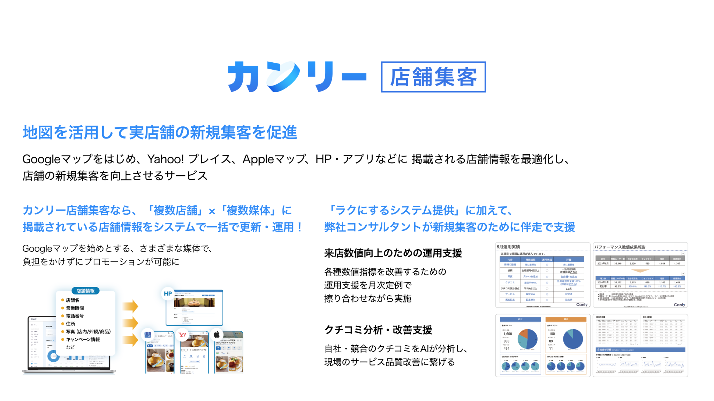
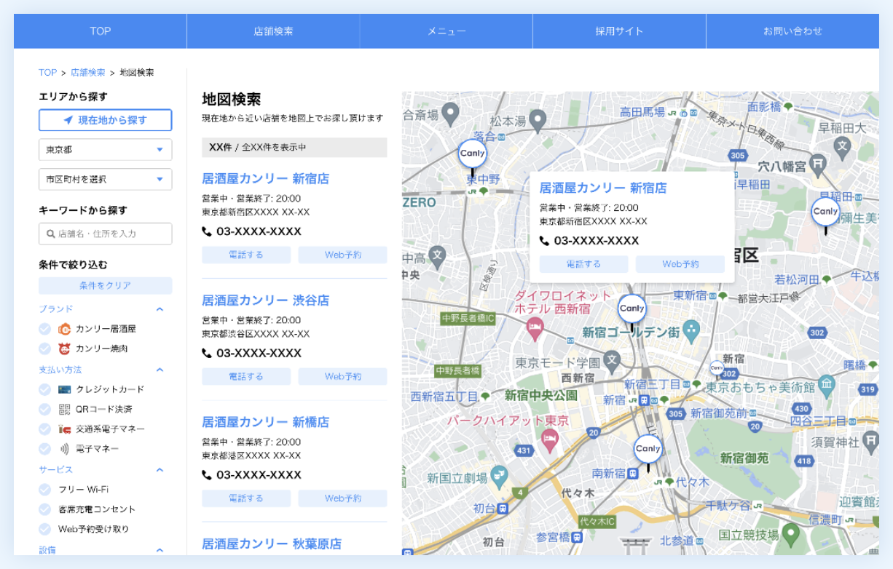
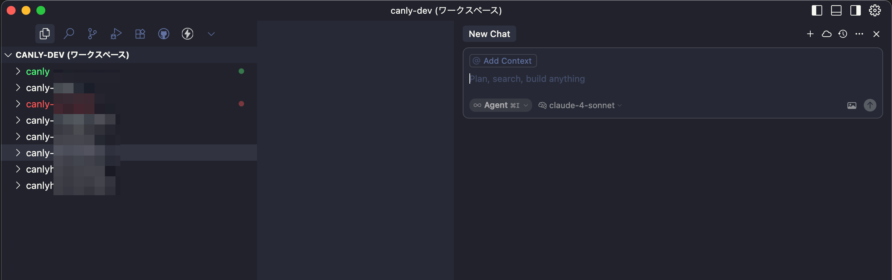
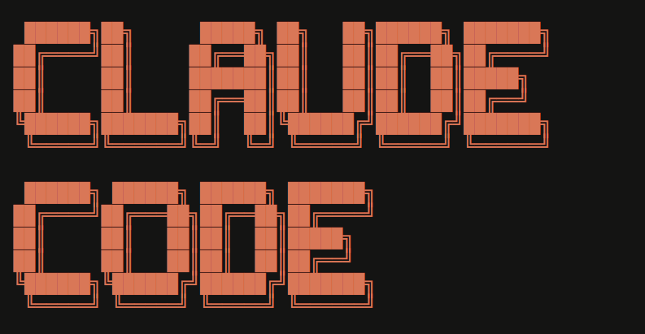
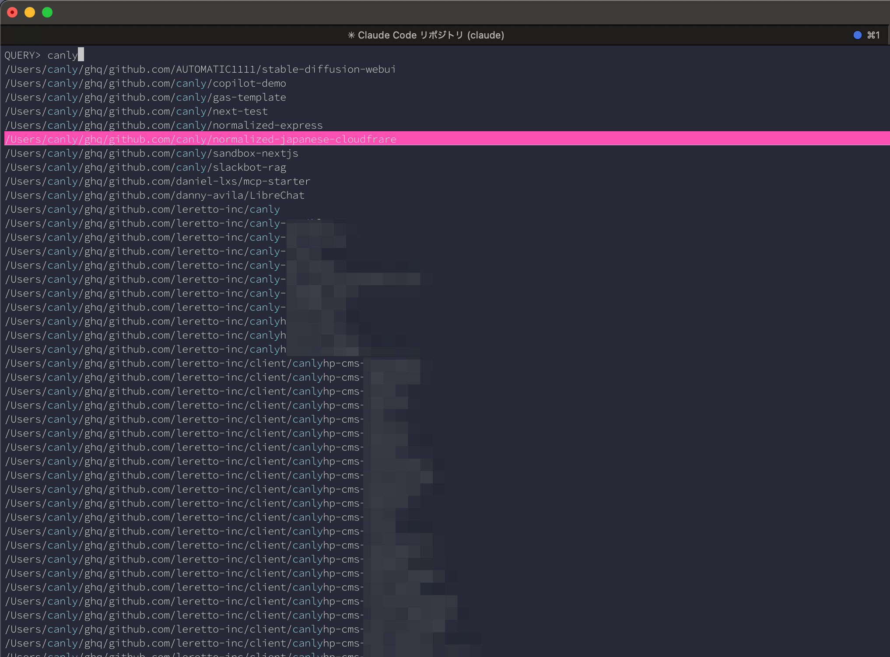

# もうモノレポは古い?<br>AI を用いたマルチレポ戦略とその実例

## 渋谷でビール片手に LT 会！第 3 木曜 LT 会 #19 <br>株式会社カンリー 角谷維

---

<!-- _class: two-column -->

## 自己紹介

<div class="flex flex-align-center">
<div>

### 🙋‍♂️ About Me

- **Name**: 角谷 維(すみや たもつ) / motsuo
- **Company**: 株式会社カンリー
- **Role**: web エンジニア / 一応フロントエンド
- **Hobbies**: 音楽 / ポーカー / 古着屋行く
- **Other**: 会社の AI rules にずんだもんが入っていて、少しイラッとする時がある
</div>
<div>


---

## 発表の前に...

軽く会社紹介させてください

---

<!-- _class: subsection -->
<!-- paginate: false -->

# 株式会社カンリー is 何?

---

## 株式会社カンリー is 何？



---

## 株式会社カンリー is 何？

### 🏠 カンリーホームページとは

- HP 来訪者の実店舗への来訪動線を**最適化するホームページ**
- クライアントは CMS として**ページ**を管理
- クライアントは店舗検索ページを簡単に作成、修正ができる
- header,footer を変更し、**サブドメイン**として運用

<div class="flex flex-sb flex-align-center">
<div>



</div>
<div>


</div>
</div>

---

## 結論

### Cursor multi-root workspace めっちゃいいですよ

---

## 結論

### Cursor multi-root workspace めっちゃいいですよ

あと、モノレポも全然いいし、古くないです。

---

## Cursor multi-root workspace とは？

- **複数のプロジェクトフォルダを一つのワークスペースで管理**する機能（VS Code 由来）
- **各フォルダが独立してインデックス化**され、AI が全体のコンテキストを把握
- **フォルダごとに`.cursor/rules`ファイル**を設定して個別の AI 指示が可能

→ 複数のリポジトリがあったらひとまず使いましょう。

例: front と back で別リポジトリだけど、同じワークスペースで管理してる時など
例: 大規模開発がかなり進んでいくと、流石にモノレポが苦しい時もありますよね。

---

## 今回のお話

現在のリポジトリ数

- 主となるリポジトリ **合計 7 つ**
  - CMS 用 フロントエンド、バックエンド
  - 店舗集客用 フロントエンド、バックエンド
  - その他 swagger 用リポジトリなど...

リポジトリを跨いで AI に指示をすることで、**チケット** 単位で AI に作業を依頼することが可能

> 💡: cursor rules を使うことで、そのリポジトリのコンテキストも把握してくれます。

---

## 実際の私の workspace



これで Front と Back を跨いで AI に指示することが可能になりました！！！

---

## 実際のユースケースその 1

- ビジネスサイドの方から 〇〇の仕様がわからないです。と連絡が来た
- 過去、1 つのリポジトリからでは**AI はわからないケース**があった
- 今回は複数のリポジトリからデータを取得しているので、**精度がかなり向上**

#### → 質問が来た際には AI に聞くことで、一旦大雑把なあたりはつけることが可能に ✨

---

## 実際のユースケースその 2

- チケット管理は **Backlog** で行っています
- Backlog MCP を用いて、リンクを投げる + これを修正してねと指示

体感 1 時間かかるチケットが大体 20 分ぐらいで終わる気がした。

<br/>

#### → 🤔 あれ...? タスク管理ツールちゃんと書いて AI に指示だせばよいのでは？

---

## あれ？？？

### 俺必要ないのでは？？？🤔🤔🤔

<div style="text-align: center;">


</div>

---

## まとめ

- **workspace**自体は保存ができるので、**タスクに応じて変える**ことで、**AI**に指示させましょう！
- ちゃんと**cursor rules**も設定して、育てていくことでいっそう**AI の精度が向上**します。
- そして**タスク管理ツール系の MCP**を入れると、**URL 入れるだけ**で目星をつけてくれたり、修正してくれたりします。

---

## appendix

### 弊社 claudecode も使えます！！



claude code もリポジトリ跨ぎさせたいよね。

---

## appendix

> https://docs.anthropic.com/en/docs/claude-code/memory
> Claude Code は、現在の作業ディレクトリ（cwd）からルートディレクトリ（/）直前まで、階層ごとに CLAUDE.md を再帰的に読み込みます。
> 複数のリポジトリが存在する場合、それぞれのリポジトリ直下やサブディレクトリに配置された CLAUDE.md が、そのリポジトリ内で有効になります。

なので、フォルダを作ってそこに階層構造にしておけば ok

```
./canly/
  ├─ canlyのフロントリポジトリ/
  ├─ canlyのバックリポジトリ/
  ├─ canlyの店舗集客フロントリポジトリ/
  └─ canlyの店舗集客バックリポジトリ/
```

---

## appendix

<br/>

フォルダ作ればいいよね〜なんですが...

**peco + ghq** というリポジトリ管理ツール + ターミナル検索ツールを使うと、しっかりと階層構造が自動的に作成され、claude code の整備も楽になるのでおすすめです。



---

<!-- _class: lead -->

# Thank you for listening!

**X**: @canly_motsuo
**GitHub**: github.com/motsuo373


このスライドを https://motsuo373.github.io/presentation-marp/ 閲覧できます。
