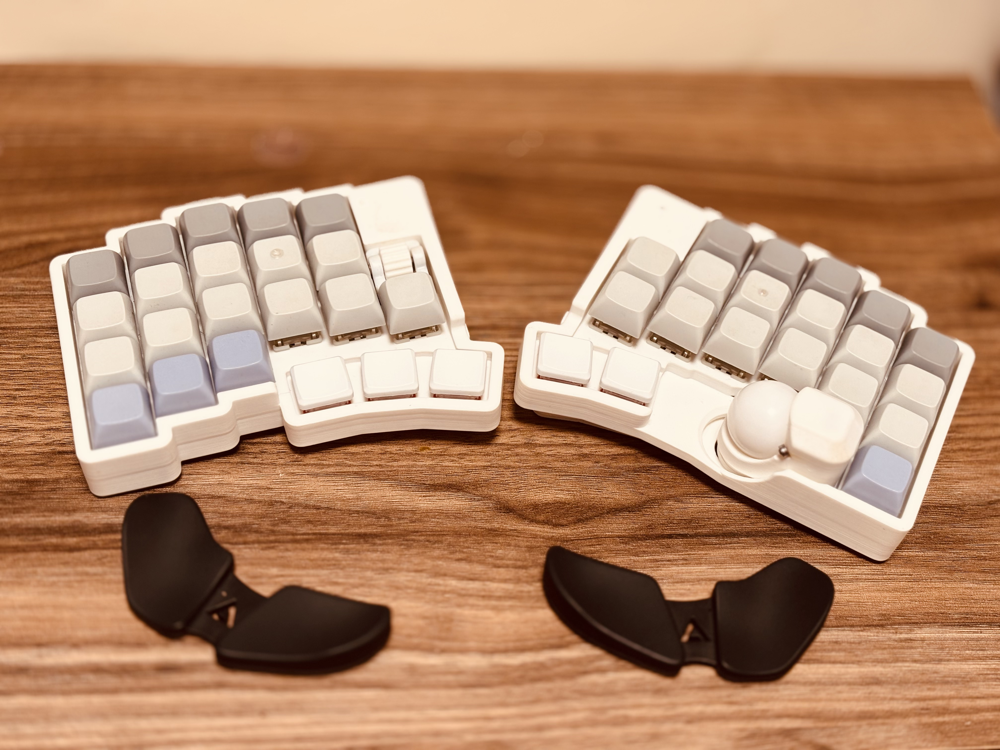
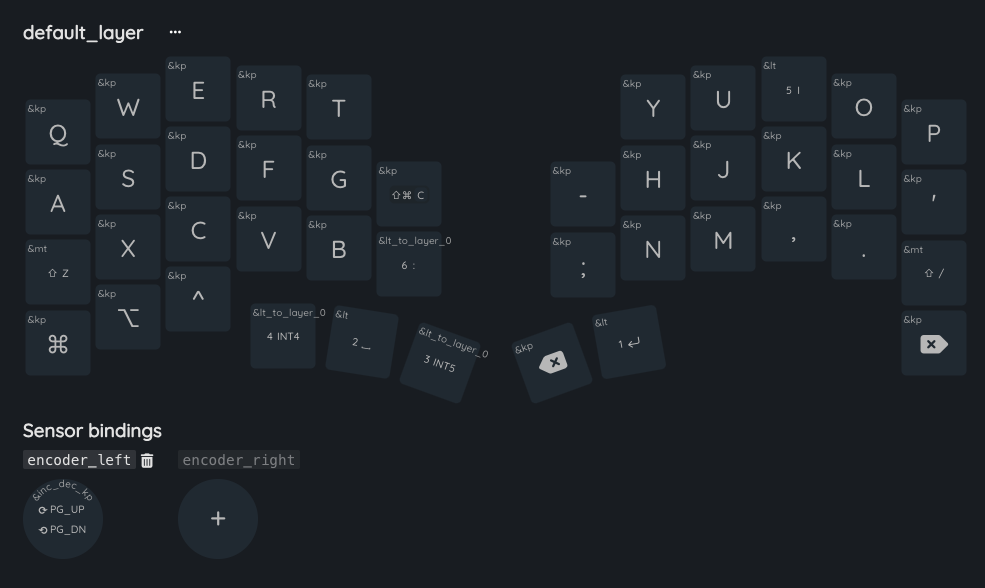
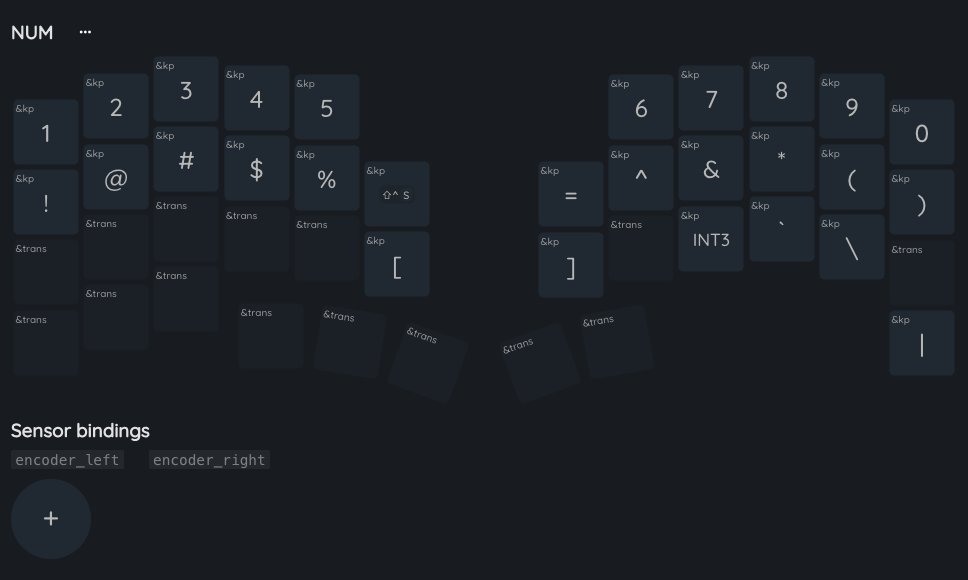
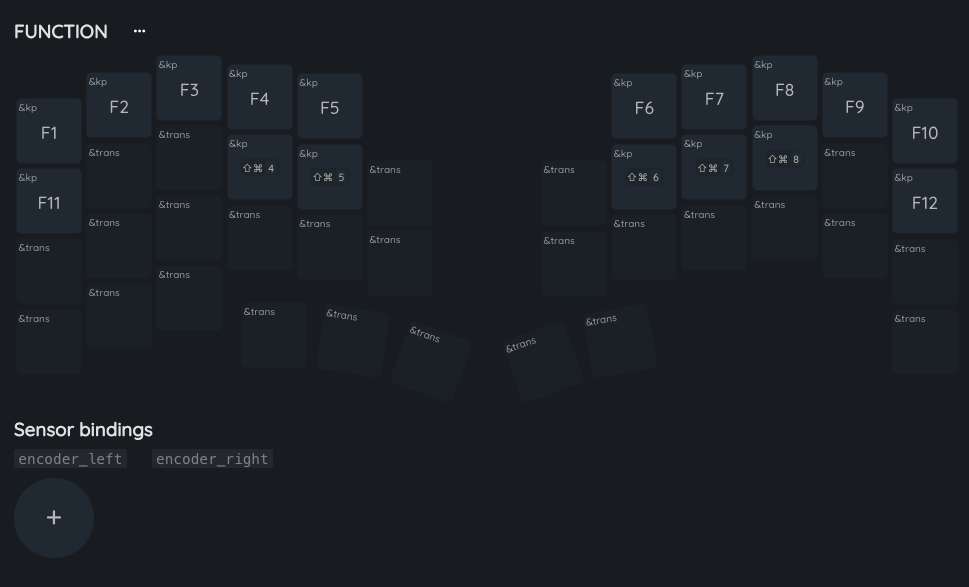
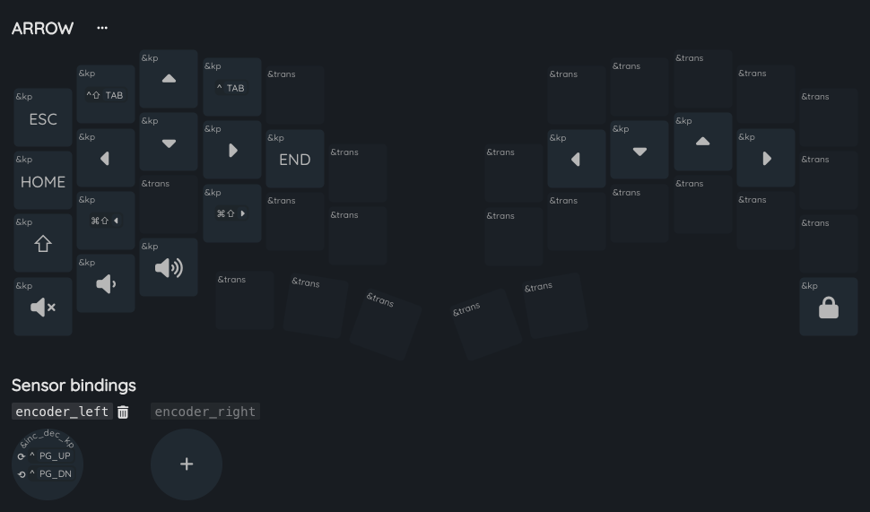
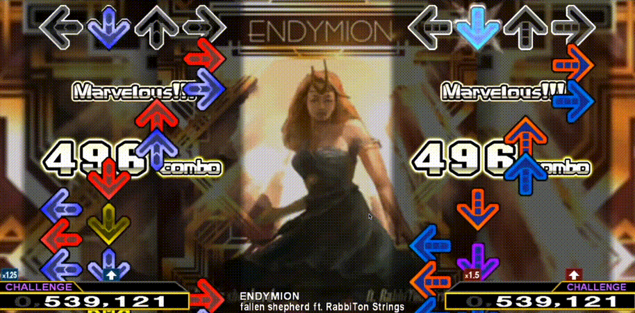
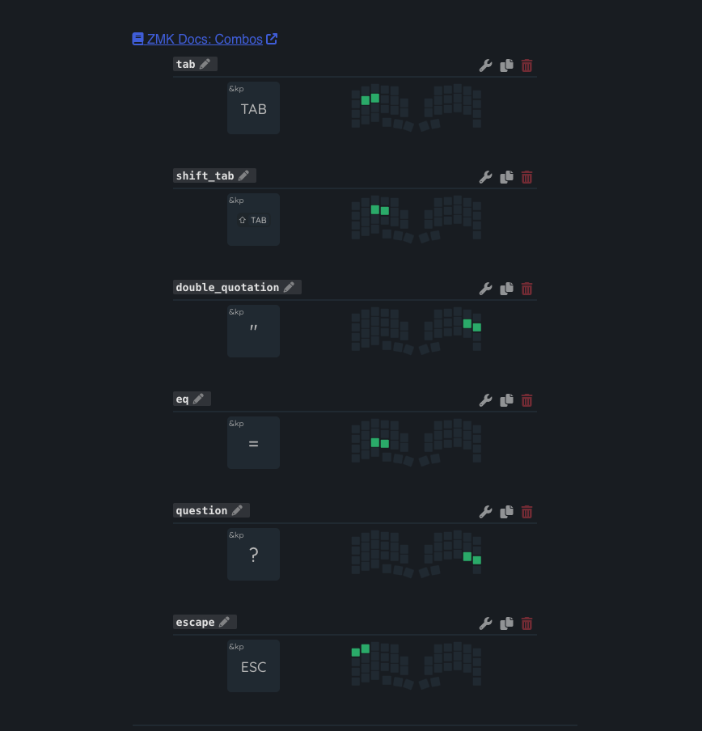

# 自キーレイアウトは とことん理由づけをしろ

## 自作キーボード沼にハマってみた   motsuo

---

<!-- _class: subsection -->
<!-- transition: melt -->

# About Me

---

<!-- _class: two-column -->

## About Me

- **Name**: 角谷 維(すみや たもつ) / motsuo
- **Company**: 株式会社カンリー
- **Role**: web エンジニア / フロントエンド
- **Hobbies**: 音楽 / ポーカー / 古着屋行く
- **Other**: 自作キーボードは現在3代目

###

---

<!-- _class: subsection -->
<!-- transition: melt -->

# My keyboard

---

## My keyboard

### キーボード遍歴

- **1代目**: lily58 pro
- **2代目**: keyball39  
- **3代目**: roBa

> 割と自作キーボード界隈では有名な3機種...  
> ハードウェア側でいい話はできないです🙏

*現在使用中のroBaキーボード*

---

<!-- _class: subsection -->
<!-- transition: melt -->

# キーレイアウトどうしてますか？

---

## キーレイアウトどうしてますか？

### 🎯 結論

キーレイアウトを考えることはその後の使用感に直結するので、

> **自分自身の理由づけをして、キーレイアウトを組みましょう。**

今回は私なりのキーレイアウトアプローチ術を紹介します。

 

え？100%キーボードを使えばいいじゃん？

---

<!-- _class: lead -->
<!-- _backgroundColor: var(--color-white) -->

😡

---
<!-- transition: melt -->

## アプローチ 1: 100%キーボードから離れない。

### 基本原則

- **既存の配列はQWERTY配列は維持する**
- **ctrl, shift, commandの位置**

### 実際の配列画面

---
<!-- transition: melt -->

## アプローチ 2: レイヤーを使い分ける、意味づけを忘れない。

### レイヤーを意識

- ボタンを押すとそのレイアウトに 変更する機能
- 使いたい内容ごとにレイヤーを 分けるのがおすすめ
- よく使う機能はセットで覚える。

### 実践例

> **Layer 0**: 通常のQWERTY  
> **Layer 1**: ファンクション
> **Layer 2**: 数字・記号
> **Layer 3**: 矢印

---
<!-- transition: melt -->

## アプローチ 2: レイヤーを使い分ける、意味づけを忘れない。

### num

数字、英字キーシフト時の記号を2段目
それ以外の記号も追加

### function

数値キーと基本一緒にする。スクショなどのキーも追加。

---
<!-- transition: melt -->

## アプローチ 2: レイヤーを使い分ける、意味づけを忘れない。

### allow

左側のキーはあまり使わない。右の矢印配置は右にDDRがいると覚えた。(vim配置とも言える)

---

<!-- transition: melt -->

## アプローチ 3: 独自機能を使う。

### 独自機能と仲良くしようという心構え。

- keyball, roBaに共通した、ボールを使うという心構え。
- オートマウスレイアウト機能と仲良くなる。（トラックボールを触ると、キーボードもマウスボタンに一部置換される機能)
- allow functionを押しながらトラックボールを触ると、矢印入力になる。
- combo機能とも仲良くなろう。

---

<!-- transition: wipe -->

## アプローチ 3: 独自機能を使う。

### combo機能とは？

特定のキーを同時に押すことで、自動的に
キーを変換してくれる機能。

- q + w で esc
- s + d で TAB
- d + f で shift + TAB

これらは子音同士でやる。w+eは
タイピングに影響でるので行わない。

  

---

<!-- transition: melt -->

## まとめ

理由づけを行ってオリジナルのキー配置を作ろう。
無理して使わないことも重要。時々配置の見直しもしましょう！

それは君にしか使えない世界に一つだけのデバイスだ！！！！

ぜひ40%キーボードユーザーの世界へ。

---
<!-- transition: melt -->

## appdex: おすすめソフト

- mousefix

- karabina-elements

---

<!-- _class: lead -->

# Thank you for listening!

**X**: @canly_motsuo  
**GitHub**: github.com/motsuo373

このスライドを https://motsuo373.github.io/presentation-marp/ で閲覧できます。
