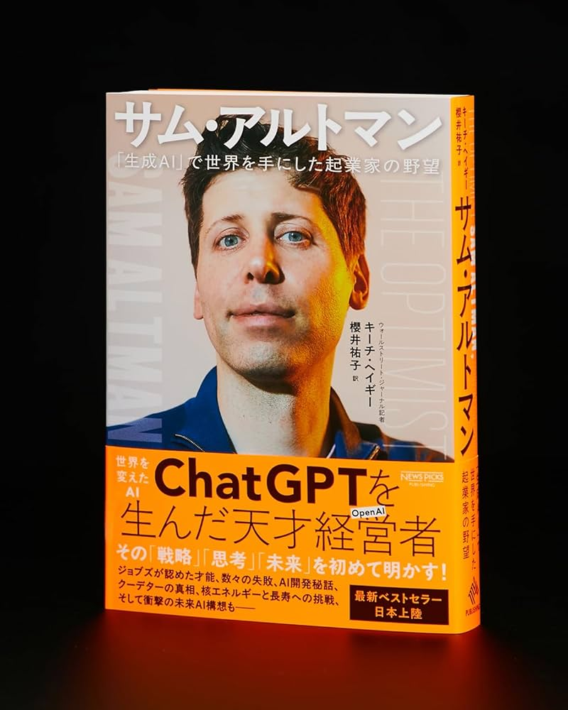
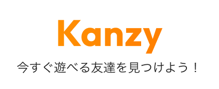
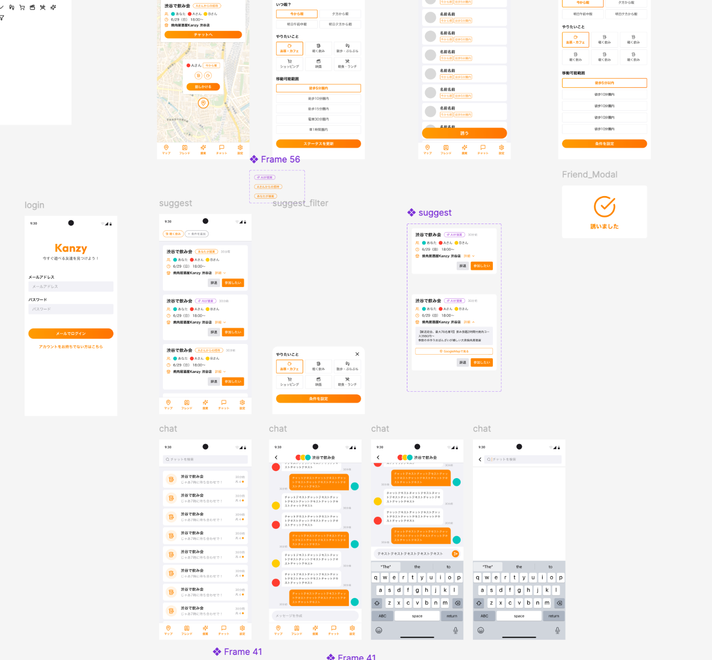
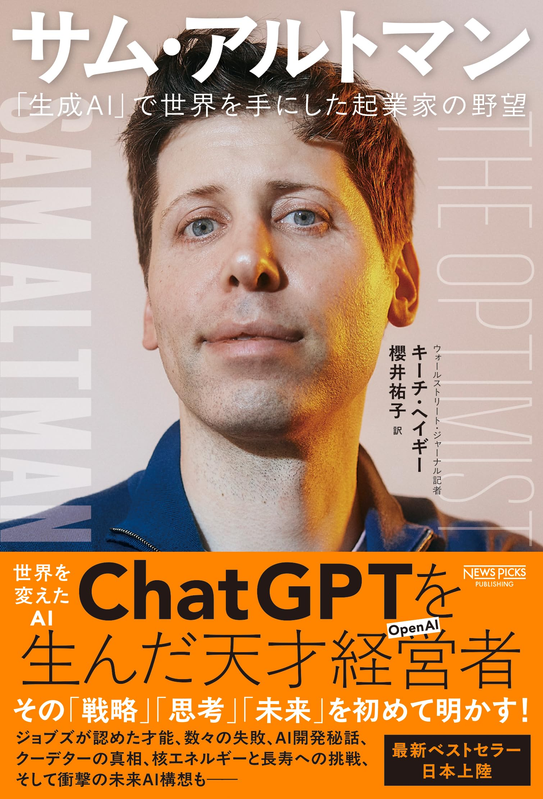

# zenn のハッカソンに<br>暇人地図検索マッチアプリを作った話

## ひとり開発・少人数開発で全部やったエンジニア LT 会 <br>角谷維

---

<!-- _class: two-column -->

## 自己紹介

<div class="flex flex-align-center">
<div>

### 🙋‍♂️ About Me

- **Name**: 角谷 維(すみや たもつ) / motsuo
- **Company**: 株式会社カンリー
- **Role**: web エンジニア / 一応フロントエンド
- **Hobbies**: 音楽 / ポーカー / キックボクシング
- **Other**: 今年は毎月4冊本を読みます

</div>
<div>


###


</div>
</div>

---

<!-- _class: two-column -->

## 最近読んだ本

<div class="flex flex-align-center">
<div>

### サム・アルトマン: 「生成AI」で世界を手にした起業家の野望
- openAIを作るまでの過程の本
- 宣伝じゃなくて面白かったので紹介

</div>
<div>


###



</div>
</div>


---

<!-- _class: subsection -->
<!-- paginate: false -->

# 今日話すこと

---

## 今日話すこと

### 第2回 Agentic AI Hackathon with Google Cloud <br/> に参加しました。

→ 結果は入賞ならず。残念。

ちなみに現在第４回目開催中でエントリー中。次こそは。

<br/>

> 💡 初めてのハッカソンで緊張しましたが、本日はここで何を作ったか
何が不足していたかを話そうと思います。

---

<!-- _class: subsection -->
<!-- paginate: false -->

# 作ったものの紹介

---

## 作ったものの紹介

### 📍 Kanzy - 暇人地図検索マッチアプリ

ふと予定が空いた瞬間、
「**今ヒマな友だちは誰？**」「**集合場所はどこ？**」「**店を決めるの面倒…**」
――そんな調整の煩わしさが、遊びの機会を奪っています。




要は **Zenly 的な位置情報共有アプリ** に **AI 幹事** を掛け合わせたもの

---

## 作ったものの紹介

### 📍 Kanzy がやってくれること

1. **ヒマな友人を自動マッチング**
2. **集合地点とおすすめ店舗を即提案**
3. **専用チャットを自動生成**

面倒な「誘い・調整・店決め」はすべて **AI が引き受ける**。
あなたは今すぐ遊びにいくだけ。

---

## 技術スタック

### 🛠️ 使用技術

| 分類           | 技術                                               |
| -------------- | -------------------------------------------------- |
| フロントエンド | React Native, Expo                                 |
| バックエンド   | Python, Node.js                                    |
| インフラ       | Firebase (Auth, Firestore, Hosting, Functions)     |
| GCP            | Gemini API, Places API (new), Cloud Run, Scheduler |
| AI 開発支援    | Cursor, Claude Code                                |

---

<!-- _class: subsection -->
<!-- paginate: false -->

# 工夫した点

---

## 工夫した点その 1

### 🤖 AI によるお店提案ロジック

1. 対象ユーザの**位置情報を全取得**
2. 位置情報から**中間地点の緯度経度**を算出
3. 緯度経度から**近くのランドマーク**を探す（駅など）
4. ランドマーク + 気分で **Places API** から店舗を複数取得
5. **Gemini AI がスコアリング**してベストな店舗を選出

→ 気分によっておすすめのプロンプトを調整することで、**適切な店舗提案を実現**

---

## 工夫した点その 2

### 📝 AI 開発時のハルシネーション対策

AI 特有のハルシネーションを防ぐため、**knowledge-data** フォルダを作成

- 基本的な仕様
- database 構造
- などを事前に書いておく

```
## Firestore コレクション
### users
| フィールド | 型 | 説明 |
|-----------|---|------|
| uid | string | Firebase Auth UID |
...
```

**context として常に持たせる**ことで不要な機能の追加を抑制

---

## 工夫した点その 3

### 🎨 デザイナーさんとの協業

- デザイナーさんに今回デザインを依頼
- **figma MCP** を用いることで、スピーディーな実装を実現
  - figmaMCP使うとデザイン通りに作ることができました。 



---

<!-- _class: subsection -->
<!-- paginate: false -->

# 苦労した点

---

## 苦労した点その 1

### ⏰ 開発期間が短すぎた

- ハッカソン出場を決めてから**ユーザーヒアリング**を始めた
- 構想はできたが**仕様の落とし込み**に時間をかけすぎた
- 結果、**開発にかける期間が短くなってしまった**

<br/>

実際の実装では期日が少し足りず、
**最低限の SNS の機能のみしか実装できていない**というのが本音...

---

## 苦労した点その 2

### 💸 コストの問題

- 本来は **Gemini Deep Research** を利用して、
  よりおすすめの店舗を推論させようと思った
- しかし**コストの問題**などもあり断念

<br/>

### 🤯 機能の膨張

開発を始めてみると、「この機能も載せられるのでは？」という
**妄想が追加で爆発**していき機能がかなり膨れ上がってしまった...

---

<!-- _class: subsection -->
<!-- paginate: false -->

# なぜリリースしていないか

---

## なぜリリースしていないか

### 🔒 位置情報の秘匿化問題

- 現在の 20 代の比較的社交的な方は、位置情報共有に抵抗が少ない印象
- ただし、みんなの位置情報は知りたいが、**人の位置情報は知りたくない**人が多かった。
- Instagram 等にあるような、**親しいフレンド機能**が必要そう
- あとは見知らぬ人と繋がるのはマッチングアプリの法律があるので知り合いのみに絞る必要があった。

<br/>

### 📅 店舗予約の自動化

- その店舗の**空き情報を取得**したい
- **自動予約機能**ができたら本当に全自動になる
- **googleの予約API**は特定の会社のみに公開されている状況

---

## なぜリリースしていないか

### そもそも位置情報アプリの意義
- マネタイズが難しい。
  - 位置情報アプリに対してみんなお金を落とすのか?
- looptという失敗から学びたい。
  - サムアルトマンが作っていた位置情報アプリ、友人の位置情報アプリを見ながら連絡ができるアプリ

→ ん？？？

---

<!-- _class: two-column -->

## ワイ = サムアルトマン説

<div class="flex flex-align-center">
<div>



</div>
<div>


###


</div>
</div>


---

## まとめ

### ハッカソンの学び

- **限られた時間**の中でチームメンバーと議論を行い、試行錯誤を重ねた
- AI というテクノロジーの力で、**コミュニケーションの障壁**を取り払いたい
- 人々がもっと気軽に**リアルな世界で繋がる**未来を創造したい

<br/>

### 個人開発のススメ

- ハッカソンは**強制的にアウトプット**できるのでおすすめ
- Cursor + Claude Code で**一人でもそれなりのものが作れる**時代
- みんなも**ひとり開発**、やってみよう！

---

<!-- _class: lead -->

# Thank you for listening!

**X**: @canly_motsuo
**GitHub**: github.com/motsuo373


このスライドを https://motsuo373.github.io/presentation-marp/ で閲覧できます。
